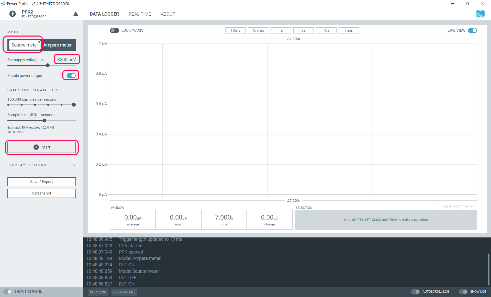

# NORDIC社 Power Profiler Kit2による消費電流の測定方法

## 概要

NORDIC社のPower Profiler Kit2を使った消費電流の測定方法について、RFM開発ボードでの測定を例に説明する。

## 事前準備

- Power Profiler Kit2(KKP2)を準備する
  - digi-key:¥12,998 (2022/5/6現在)

- ツールソフト「Power Profiler」をPCにインストールする
  - ["nRF Connect for Desktop"をダウンロード](https://www.nordicsemi.com/Products/Development-tools/nRF-Connect-for-desktop/Download)する

  - ダウンロードしたファイルを実行して、「Power Profiler」をインストールする
  
  - 参考ページ
    - [Get Started](https://www.nordicsemi.com/Products/Development-hardware/Power-Profiler-Kit-2/GetStarted)
    - [Power Profiler Kit2 詳細資料](https://infocenter.nordicsemi.com/index.jsp?topic=%2Fug_ppk2%2FUG%2Fppk%2FPPK_user_guide_Intro.html&cp=10_8)

## RFM開発ボードへの接続

- Power Profiler Kit2の以下ピンのコネクタを利用して開発ボードと接続する(Source Meterモード時)
  - VIN : 未接続
  - VOUT : 開発ボードのEXTVIN
  - GND : 開発ボードのGND

  

## 測定手順

1. Power Profiler Kit2の"USB DATA/POWER"のコネクタ(マイクロUSB)とPCをUSBケーブルで接続する  
  
1. PCで"nRF Connect for Desktop"を実行して、Power ProfilerのOpenボタンをクリックする  
  
1. 左メニューの"SELECT DEVICE"→"PPK2"をクリックする
  
1. RFMのVINSELをEXT側に設定する
1. 以下の設定を行い、"Start"ボタンをクリックする
    - MODE : Source meter
    - Set supply voltage to : 3300mV (設定可能な電源電圧は0.8～5.0V)
    - Enable power output : ON(右側)
    

1. 測定が開始され、消費電流の波形が表示される
  
  拡大
  

## TIPS

### 指定範囲の測定

- 範囲を指定して、その間の消費電流の平均値と最大値を表示することができる
  - "Stop"ボタンをクリックして、測定を停止する
  - 波形表示されている画面上で、Shiftボタンを押しながらドラッグして、範囲を指定する
  - "SELECTION"ウィンドウに選択範囲の情報が表示される
  
  
### 測定データのCSVエクスポート

- 左メニューの"Save / Export"をクリックする
- "EXPORT"をクリックする
- "Export Selection to CSV"画面が表示されるので、出力範囲/項目を選択して"Save"ボタンを押す
  - AREA TO EXPORT : All / Window
  - Timestamp : ON / OFF
  - Current : ON / OFF
  - Digital logic pins (single string field)
  - Digital logic pins (separate fields)  
  
  

### サンプリングレートの設定

- SAMPING PARAMETERSを設定することで、サンプリングレートを変更できる
- サンプリングレートと測定時間の関係は以下の通り。

    |  サンプリングレート(sampling/sec)  |  最大測定時間  |
    | :---: | :---: |
    |  1  |  578 days  |
    |  10  |  57 days  |
    |  100  |  138 hours  |
    |  1,000  |  13 hours  |
    |  10,000  |  83 minutes  |
    |  100,000  |  500 seconds  |

## その他

### 外部からの電源供給による電流測定(Ampere Meterモード)

- Power Profiler Kit2から電源供給は行わず、電流のみを測定する"Ampere Meter"モードがある
- お客様の機器にRFMを組込んだ状態で、RFMのみの消費電流を測定する場合などでの使用が想定される
- Power Profiler Kit2の以下ピンのコネクタを利用して開発ボードと接続する
  - VIN : 開発ボードのVINSELのUSB側ピン (DUTの+側)
  - VOUT : 開発ボードのVINSELの中央のピン (DUTの-側)
  - GND : 開発ボードのGND  
  

- Power Profilerを起動して以下の設定を行い、"Start"ボタンをクリックする
  - MODE : Ampere meter
  - Enable power output : ON(右側)
  
