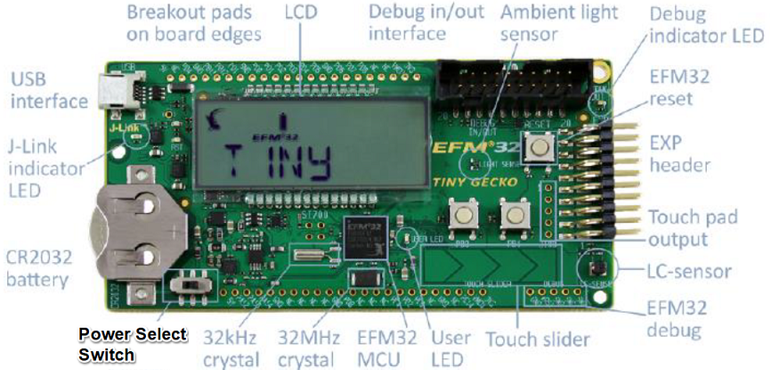

# Silicon Labs社 EFM32 Starter Kitによる消費電流の測定方法

## 概要

Silicon Labs社のEFM32 Starter Kitを使った消費電流の測定方法について、RFM開発ボードでの測定を例に説明する。

## 事前準備

- Starter Kitを準備する
  - EFM32 Tiny Gecko Starter Kit board:EFM32TG-STK3300
    - digi-key:¥13,912 (2022/5/2現在)
  
  

- 統合開発環境Simplicity Studio v3をPCにインストールする
  - <https://jp.silabs.com/developers/simplicity-studio>
  - (注意)現在v4,v5のみdownload可能。
  - 上記Starter Kitの場合、v3でしか消費電流測定ソフト「Energy Profiler」が動作しなかった

## RFM開発ボードへの接続

- Starter KitのEXP headerの以下ピンをRFM開発ボードと接続する
  - VMCU(EXP header 2pin) : 開発ボードのEXTVIN
  - GND(EXP header 1pin)  : 開発ボードのGND

  

## 測定手順

1. Starter KitのPower Select SwitchをAEM側(ホルダーとは逆方向側)に設定して、PCとUSBケーブルで接続する
1. Simplicity Studioを起動して、"Energy Profiler"を起動する

1. メニューのRun→Run Demo→STK3300 emlcdを選択する

1. Starter KitのPB0ボタンを複数回押して、EM4モードに遷移する(LCDにモード表示あり)

   - "STK3300 emlcd"デモで上記操作を行うことで、Starter Kit上のCPU(EFM32TG)の消費電流が1uA以下になる

1. 測定が開始され、消費電流の波形が表示される
  
  拡大
  

## TIPS

### 指定範囲の測定

- 範囲を指定して、その間の消費電流の平均値(A)と消費電力の平均値(W)、電力量(J)を表示することができる
  - 一時停止ボタンをクリックして、測定を停止する
  - 波形表示されている画面上で、ドラッグして、範囲を指定する
  - "Selected Rannge"に選択範囲の情報が表示される
  

## その他

### EXP_headerピン配置図 (参考)

  

### AEM(Advanced Energy Monitor)ブロック図 (参考)

  
